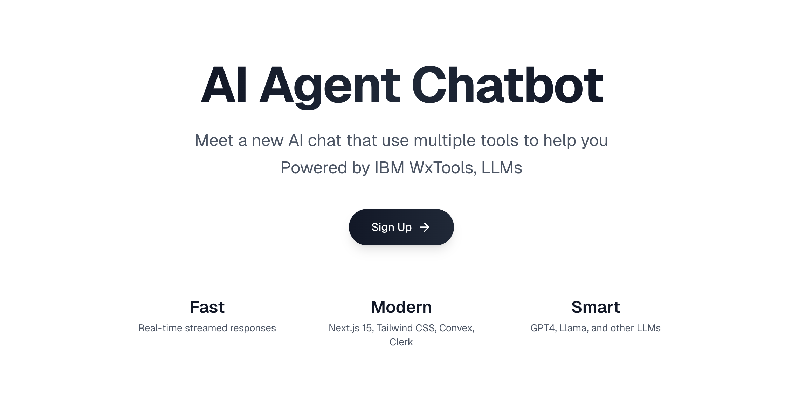
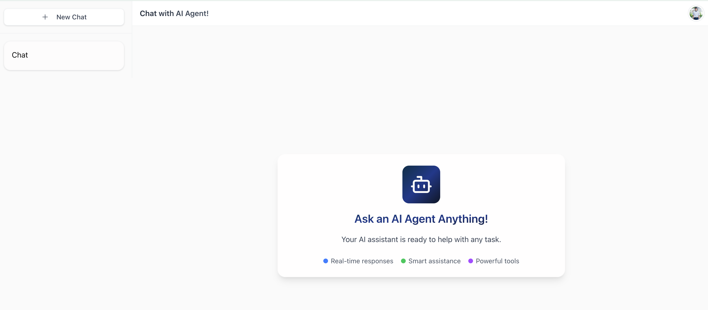
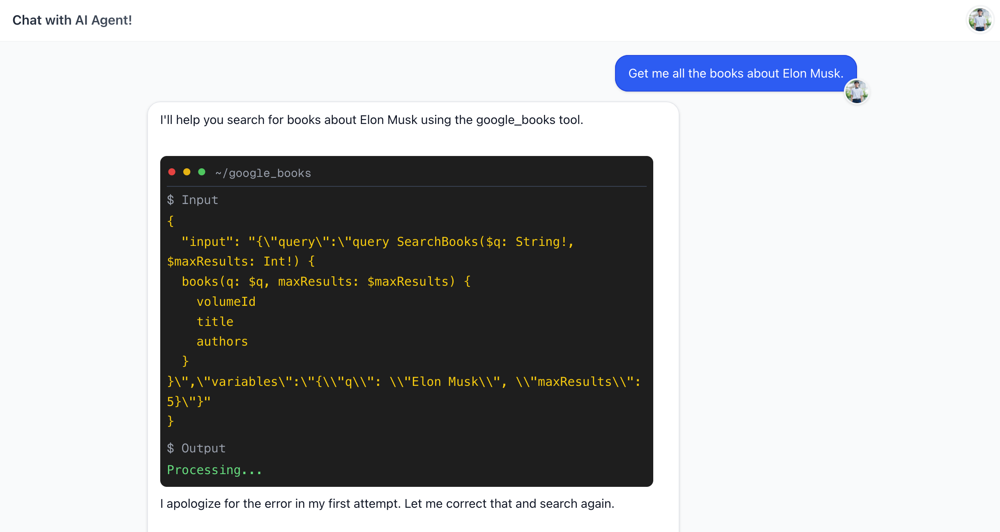
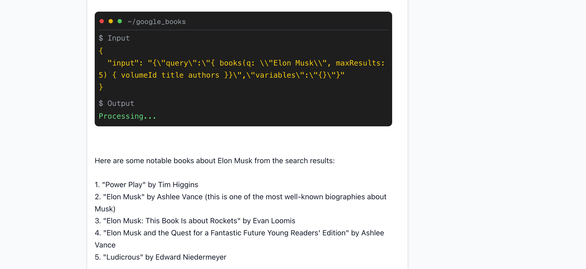
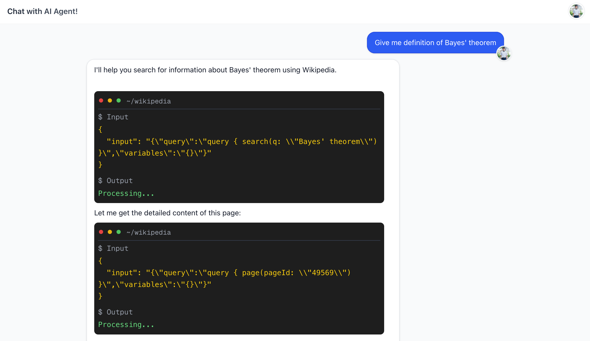
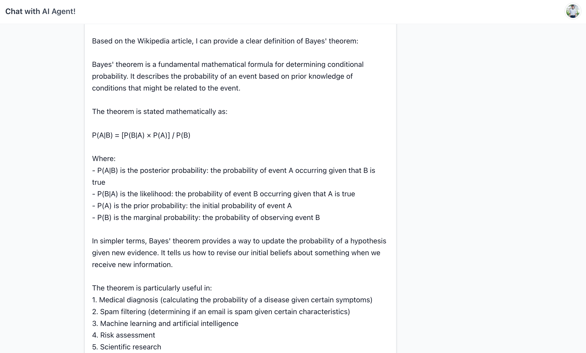

# ChatAgent

A full-stack AI chatbot built with Next.js that can interact with users in real-time using streaming responses. The agent can execute various tools autonomously and provides a terminal-like interface to display tool operations, making it suitable for a wide range of applications including data retrieval, analysis, and task automation.

<table>
  <tr>
    <td>
      
    </td>
    <td>
      
    </td>
  </tr>
</table>

## 👨‍💻 Contributors
- Tuan (Alan) Le (tuanlattnlhp@gmail.com)

## 💾 Technologies
- Frontend: Next.js, React, Tailwind CSS, Server-Sent Events (SSE) for streaming responses
- Backend: Next.js API Routes, Convex Database, Clerk Authentication
- AI Agent Framework: LangChain, LangGraph for agent workflow orchestration, Claude 3.5 Sonnet, IBM Wxflows

## 🌟 Features
- Real-time streaming chat interface with typing indicators
- Tool execution with visual terminal-like display
- Support for multi-turn conversations
- Authentication and user management
- Persistent chat history

## Agent Tools
### Search and retrieve books using Google Books API
- Search for books by title, author, or other criteria
- Get detailed information about specific books including descriptions, ratings, and publication details

<table>
  <tr>
    <td>
      
    </td>
    <td>
      
    </td>
  </tr>
</table>

### Search and retrieve Wikipedia Information using Wikipedia Search API
- Search Wikipedia articles
- Retrieve detailed information from specific Wikipedia pages

<table>
  <tr>
    <td>
      
    </td>
    <td>
      
    </td>
  </tr>
</table>

### Get Customers and Comments Data
- Access customer information including names, addresses, and order histories
- View shipping and tracking information for orders
- Retrieve comments data including user information, likes, and post details

### Retrieve YouTube Video Transcripts

- Get transcripts from YouTube videos when you provide a video URL
- Supports multiple languages (default is English)

## Getting Started

First, get all the API keys:
```bash
NEXT_PUBLIC_CLERK_PUBLISHABLE_KEY=<your-api-key>
CLERK_SECRET_KEY=<your-api-key>
CONVEX_DEPLOYMENT=<your-api-key>
NEXT_PUBLIC_CONVEX_URL=<your-api-key>
ANTHROPIC_API_KEY=<your-api-key>
OPENAI_API_KEY=<your-api-key>
WXFLOWS_ENDPOINT=<your-api-key>
WXFLOWS_APIKEY=<your-api-key>
```

Second, run the development server:
```bash
npm run dev
# or
pnpm dev
```
Third, run the Convex database:
```bash
npx convex dev
```

Open [http://localhost:3000](http://localhost:3000) with your browser to see the result.

This project uses [`next/font`](https://nextjs.org/docs/app/building-your-application/optimizing/fonts) to automatically optimize and load [Geist](https://vercel.com/font), a new font family for Vercel.


## Acknowledgement 
This project is built based on the code base from Sonny Sangha's chatbot tutorial. 
